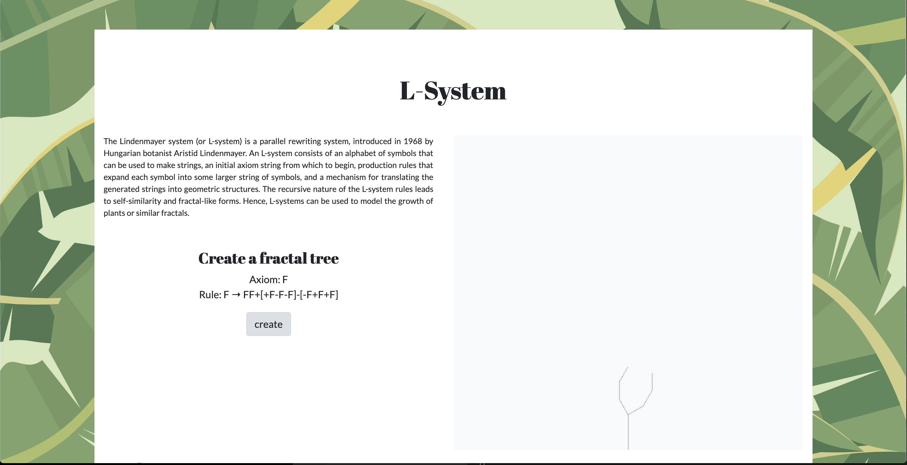
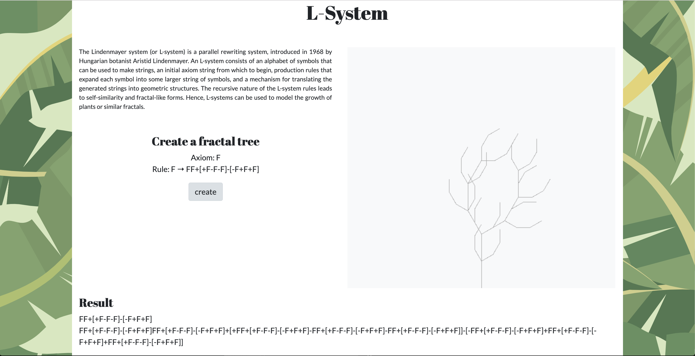

# L-system

The Lindenmayer system (or L-system) is a parallel rewriting system.

L-systems consists of an alphabet of symbols that can be used to make strings, aninitial axiom string from which to begin, production rules that expand eachsymbol into some larger string of symbols, and a mechanism translating thegenerated strings into geometric structures. 

The recursive nature of the L-system rules leads to self-similarity and fractal-like forms. 

# The project

Basic implementation of L-systems in Golang and Turtle graphics using image.RGBA.
Web app uses default server and html/template.

Iteration 2
OnClick generate L-system.

